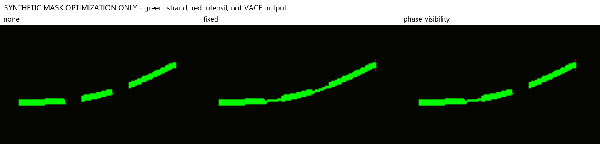

# Day 14 contact/visibility guidance: first feasibility experiment

Date: 2026-09-07 Asia/Tokyo (run completed on 2026-09-06 UTC).

## Result

The proposed differentiable constraint behaved as intended on synthetic masks,
but its analytic RGB observer failed the prerequisite semantic counterfactual
checks. **No new VACE inference ran.** There is no new natural-video result or
evidence that contact-guided VACE is effective.

The implementation is `foodstateedit/contact_guidance.py`; reproducible CPU
entry point is `scripts/run_contact_guidance_observer_pilot.py`. The protocol in
`configs/contact_guidance_observer_pilot_v1.json` was hashed before scoring. All
data bytes were checked against the frozen Day 13 manifest. All nine gates had
to pass; four RGB counterfactual gates failed. Thresholds were not adjusted.

## Algorithm actually tested

- A differentiable soft weakest-link score samples predicted strand evidence
  along the expected projected 3D curve.
- Contact evidence samples the predicted noodle endpoint and both expected
  utensil tips, rather than substituting the control masks for observations.
- Source/approach frames do not receive contact/lift guidance. At contact,
  lift and hold, the constraints activate.
- A known occlusion only exempts strand samples that overlap a closer utensil
  in image space. A depth crossing without screen overlap is insufficient.
- The RGB observer is an explicitly labelled analytic color likelihood. It is
  **not** instance segmentation or a validated topology detector.

The objective is a fixed-path evidence surrogate. It does not discover an
arbitrary connected path, certify topology, or distinguish object identity.

## Synthetic-mask optimization (not VACE output)

Three conditions started from the same broken strand and absent utensil
probability fields. The two optimized conditions used 60 Adam steps at 0.35.

| Condition | Final constraint energy, lower is better | Noodle probability in known hidden region |
|---|---:|---:|
| No correction | 1.297263 | 0.020000 |
| Fixed constraints, ignoring visibility | 0.001142 | 0.449226 |
| Phase/visibility-aware constraints | 0.001194 | 0.020000 |

Both objectives can reduce their own energy. Fixed constraints also paint
through the occluder; the visibility-aware version leaves that hidden section
unchanged while repairing the exposed break in the synthetic probability map.
This validates limited loss behavior, not video naturalness or learned skill.

## RGB counterfactual test

Five versions of the same local synthetic-target image were evaluated at the
frozen final-hold frame. The same geometry, observer and weights were used.
Counterfactual fixtures restore pixels from the source or insert a solid color;
these are measurement controls, not generated results.

| RGB input | Total energy, lower is better |
|---|---:|
| Unedited source | 1.183022 |
| Existing synthetic target | 1.193023 |
| Planned strand region restored to source | 1.183022 |
| Planned utensil region restored to source | 1.142314 |
| Solid noodle-colored block | **0.518024** |

The observer prefers the unedited source to the target, and strongly prefers a
solid color block. Removing planned utensil pixels also lowers its energy.
All four semantic counterfactual gates fail. A nonzero finite RGB gradient
exists, but optimizing that gradient could reward these incorrect outcomes.

The local diagnostic board is stored under
`artifacts/day14_contact_guidance_observer_20260907_v3/rgb_observer_counterfactuals.png`.
It has been visually reviewed. Source-containing crops remain local.

## Additional alignment finding

The overlay of the frozen Day 13 curve and tips on the target shows that the
expected curve is displaced from the conspicuous lifted strand. Only 26.19% of
visible path samples exceed RGB MAE 10 between source and target; this change
statistic alone does not prove misalignment, but the overlay supplies a concrete
reason to audit the pairing. Contact is sampled at expected coordinates, not at
independently detected generated endpoints.

This is an additional possible contributor to failed supervision. It does not
prove the cause of all earlier negative results, and it prevents attributing
those results exclusively to the VACE renderer or its untrained low-noise branch.

## Resource and execution evidence

All five hosts were reachable with a 40-second multihop SSH handshake window.
At 2026-09-06 14:52:56 UTC, gp38/gp39/gp40 each showed eight RTX A6000 GPUs,
48,539 MiB free on each GPU, 0% utilization, and no compute processes. Host
available memory was 249,739 / 252,762 / 253,426 MiB respectively. gp41 is A40;
gp42 is Blackwell. Neither was eligible under the existing resource policy.

GPU inference was stopped at the observer gate, not at resource availability.
No remote data was changed and no model was downloaded or loaded.

## Verification

The default full suite ran 140 tests: 128 passed and 12 were skipped because
that interpreter lacks NumPy/PyTorch. In the bundled CPU runtime, all nine new
guidance tests and all eleven existing projection tests passed, covering every
previous skip. Compilation and `git diff --check` also passed. The result JSON,
pre-run freeze and synthetic-mask figure were copied into the tracked result
directory with equal source/destination SHA-256 values.

Machine-readable result: `day14_contact_guidance_observer_20260907/result.json`.

## Preserved attempts

1. `artifacts/day14_contact_guidance_observer_20260906_v1`: PyTorch optimizer
   import failed because the local optional SymPy dependency lacked mpmath.
   No score was computed. Pre-run hashes and failure explanation are preserved.
2. `artifacts/day14_contact_guidance_observer_20260907_v2`: scored RGB negative
   result, plus a synthetic fixture boundary mismatch. The finite-width
   occluder covered bilinear samples outside its centerline index interval.
3. `artifacts/day14_contact_guidance_observer_20260907_v3`: visibility is derived
   from that same known occluder raster. Objective, RGB fixtures and thresholds
   did not change. Four mask gates and the gradient gate pass; four RGB gates
   still fail. No output directory was overwritten.

## Next prerequisite

The next version needs an independently checked strand/utensil observer and
geometry-to-target alignment. Adding a ridge cue alone is not accepted without
testing the same color-block/no-edit counterexamples plus new held-out
counterexamples. Only then should the existing VACE scheduler be modified and
memory-profiled for latent guidance. A passing surrogate test must never be
reported as a natural VACE result.
