# 全部 24 例原图 / A / B / 局部对比

[返回实验说明](README.md) · [AI 审查原始记录](visual_reviews.json)

每幅对比图已包含原图、生成 A、默认最终 B，以及源缺口和勺头局部；所有例子均保留。评级是 AI 视觉筛查，数据全部此前已观察过。

## real_00_2330 · meat

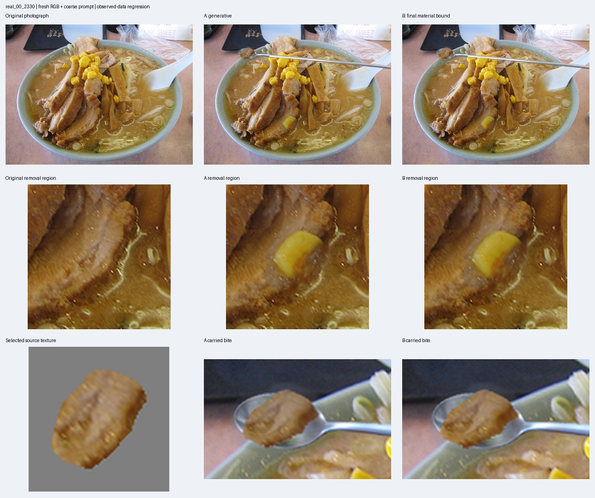

[原图](assets/real_00_2330/source.png) · [生成 A](assets/real_00_2330/A.png) · [最终 B](assets/real_00_2330/final.png)

勺上肉片与源纹理相近，明显离盘且有承托；原位置却新增黄色块，未形成合理缺口。B 主要调整颜色，对源问题没有影响。

## real_01_2198 · noodles

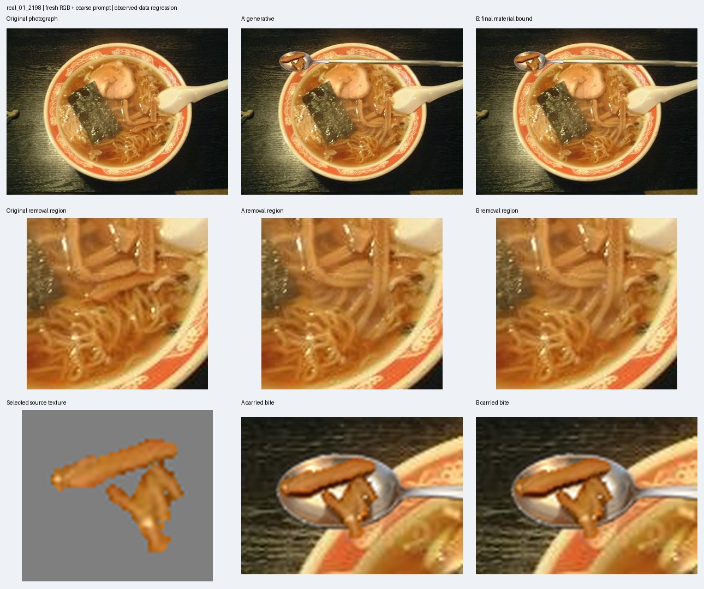

[原图](assets/real_01_2198/source.png) · [生成 A](assets/real_01_2198/A.png) · [最终 B](assets/real_01_2198/final.png)

实际选中棕色条状配料，勺头颜色对应；部分食物薄而悬出勺碗。源区原配料被延长重构，看不出可信减量。

## real_02_16784 · chicken

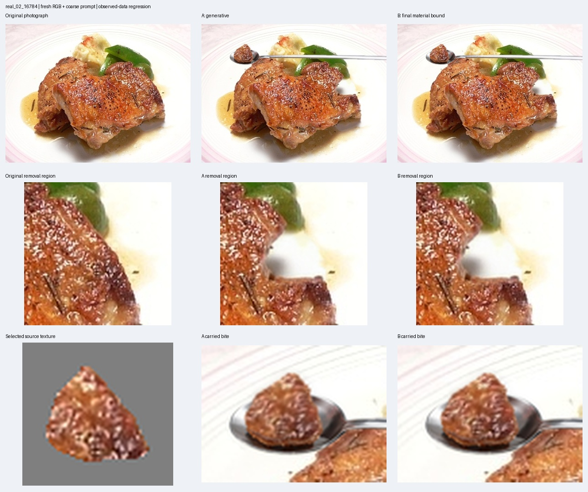

[原图](assets/real_02_16784/source.png) · [生成 A](assets/real_02_16784/A.png) · [最终 B](assets/real_02_16784/final.png)

鸡肉第一口明显离盘，勺头承托、柄伸出边框。源鸡肉右侧形成清楚缺口，但亮白下层与较硬边缘仍是推断，局部存在修补感。

## real_03_7889 · pork

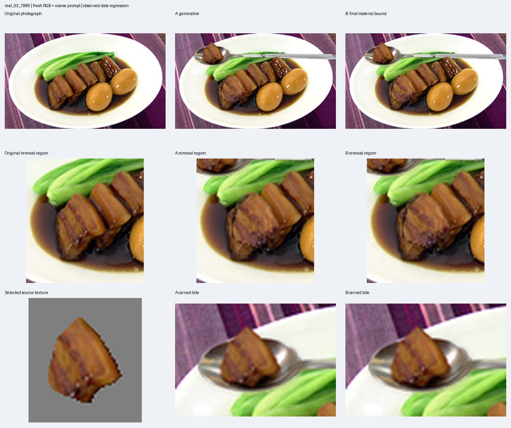

[原图](assets/real_03_7889/source.png) · [生成 A](assets/real_03_7889/A.png) · [最终 B](assets/real_03_7889/final.png)

勺上五花肉颜色和条纹相容、离盘明显。源第一块肉被重新画成完整圆厚块，缺少明确减少；局部轮廓较生硬。

## real_04_11680 · food

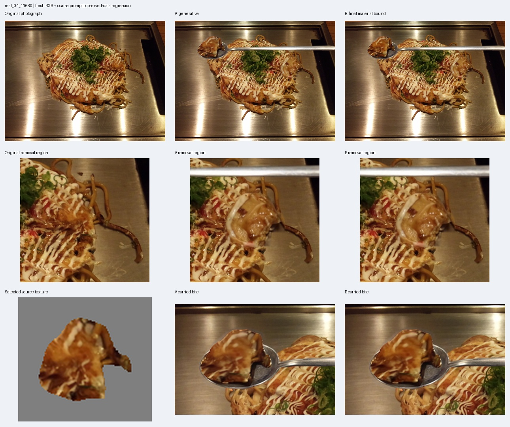

[原图](assets/real_04_11680/source.png) · [生成 A](assets/real_04_11680/A.png) · [最终 B](assets/real_04_11680/final.png)

勺上的棕色面饼片与源颜色相容、离盘清楚，柄已出画；原位置却长出圆润胶状棕色块，未正确表现减少。

## real_05_8131 · sashimi

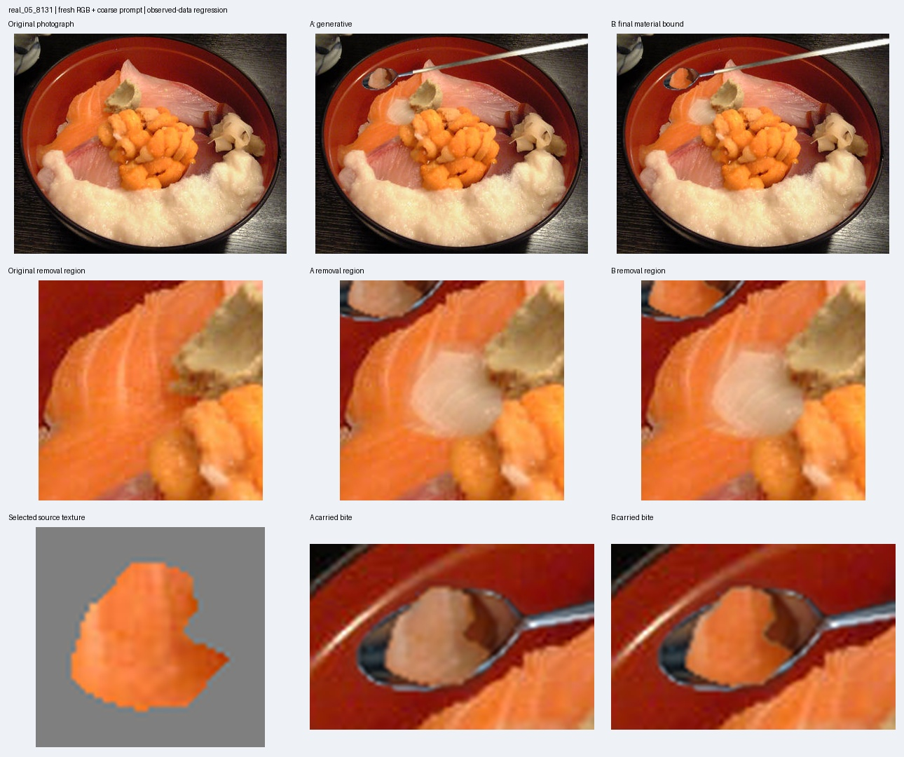

[原图](assets/real_05_8131/source.png) · [生成 A](assets/real_05_8131/A.png) · [最终 B](assets/real_05_8131/final.png)

B 将 A 的浅色勺上食物恢复为源橙色，修复明确色差；形状仍像平面片，原鱼片位置出现浅色圆形补丁。自动标签 carrot 与实际源鱼片不符。

## real_06_2862 · food

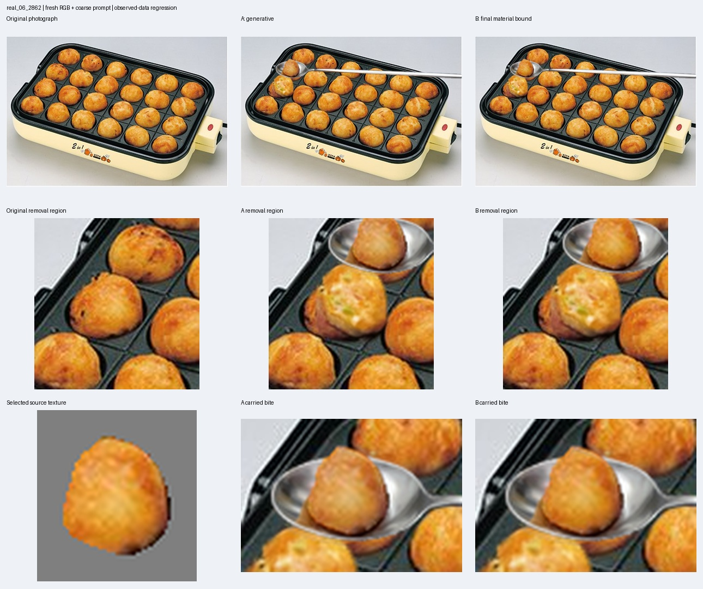

[原图](assets/real_06_2862/source.png) · [生成 A](assets/real_06_2862/A.png) · [最终 B](assets/real_06_2862/final.png)

丸子的一口被勺子托起，原丸子露出较浅的内部，减量可辨；切面偏圆整、边缘有修补感。B 使勺上材料更金黄，未解决切面真实性。

## real_07_10704 · fish shaped pancake

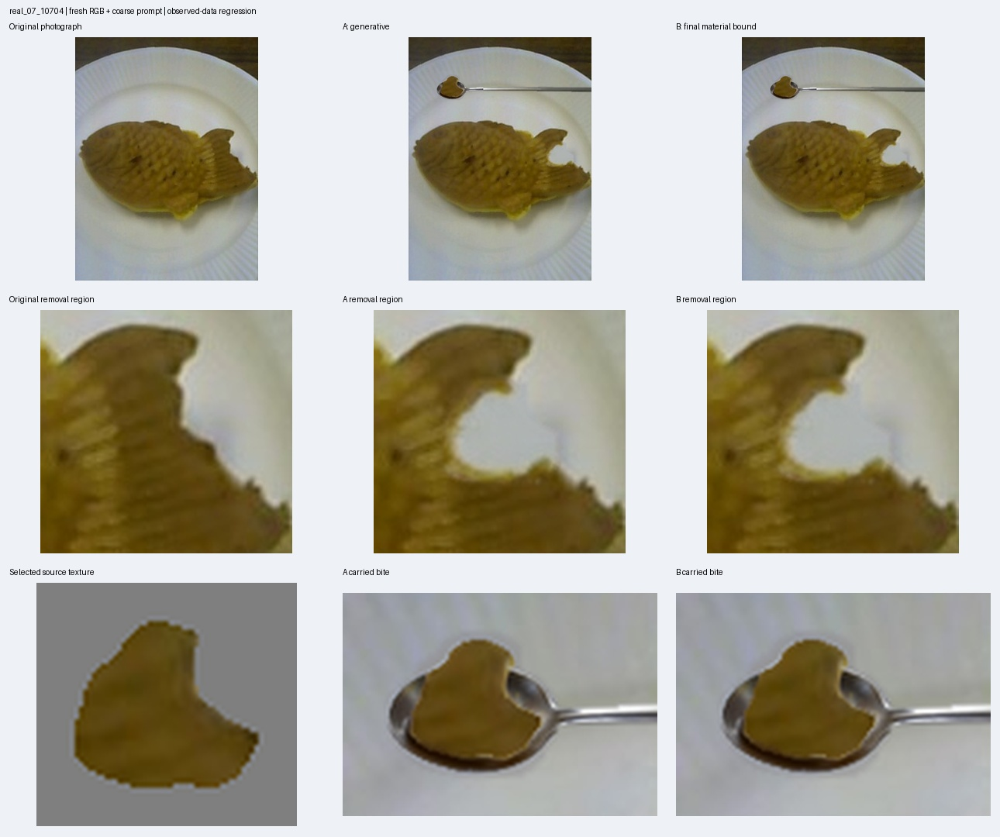

[原图](assets/real_07_10704/source.png) · [生成 A](assets/real_07_10704/A.png) · [最终 B](assets/real_07_10704/final.png)

鱼形饼尾出现明确开放缺口，第一口在上方勺内；但勺上材料过平且表面纹理弱，无法确信自然，源缺口颜色也较均匀。

## real_08_2205 · noodles

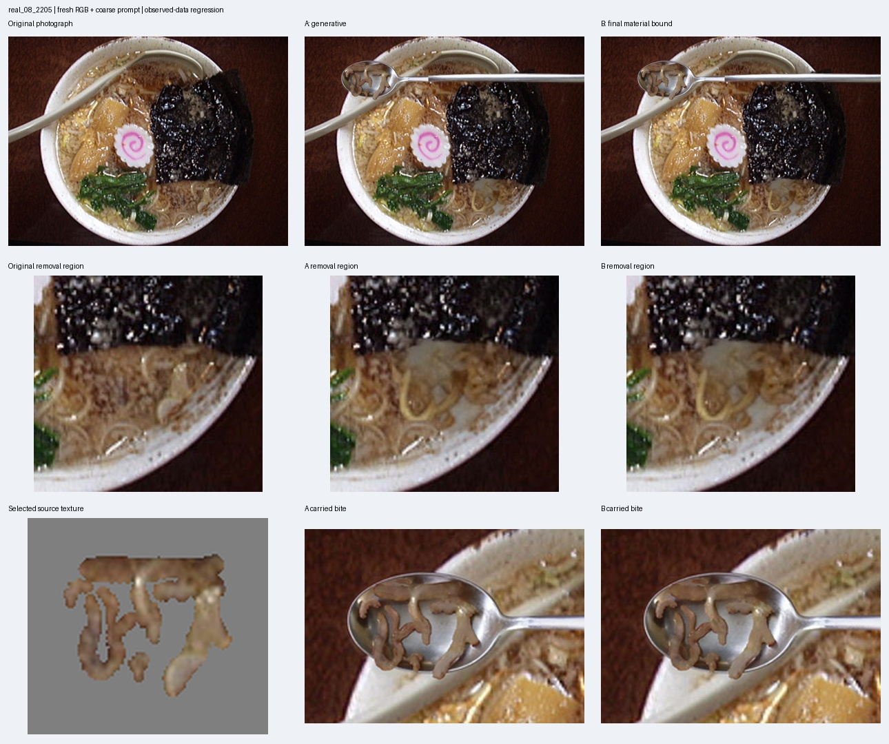

[原图](assets/real_08_2205/source.png) · [生成 A](assets/real_08_2205/A.png) · [最终 B](assets/real_08_2205/final.png)

被搬运材料呈几段扁平、不均匀的褐色环带，立体圆条外观不可信；原位置多出灰褐色团块，不能认定为自然減量。柄出画已保持。

## real_09_3901 · omelet

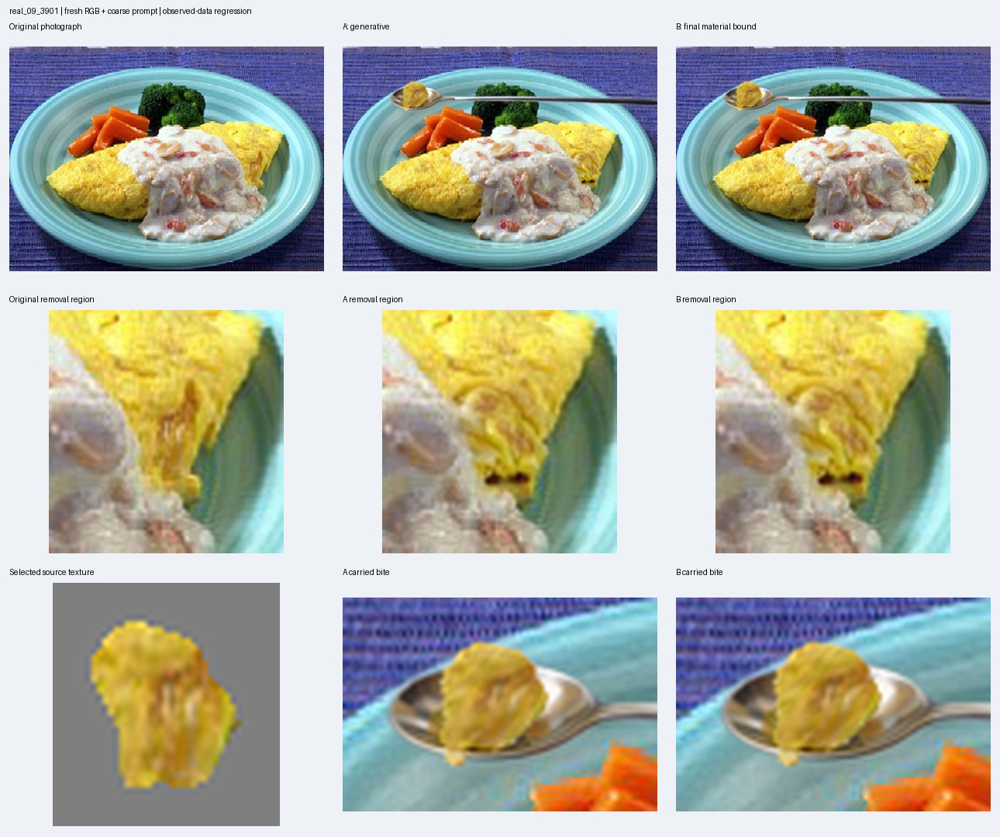

[原图](assets/real_09_3901/source.png) · [生成 A](assets/real_09_3901/A.png) · [最终 B](assets/real_09_3901/final.png)

勺上黄色蛋皮与源相容且明显抬升；原蛋包边缘留下重绘的黄色卷和黑色小孔，缺口仍像新长出的材料。

## real_10_2555 · noodles

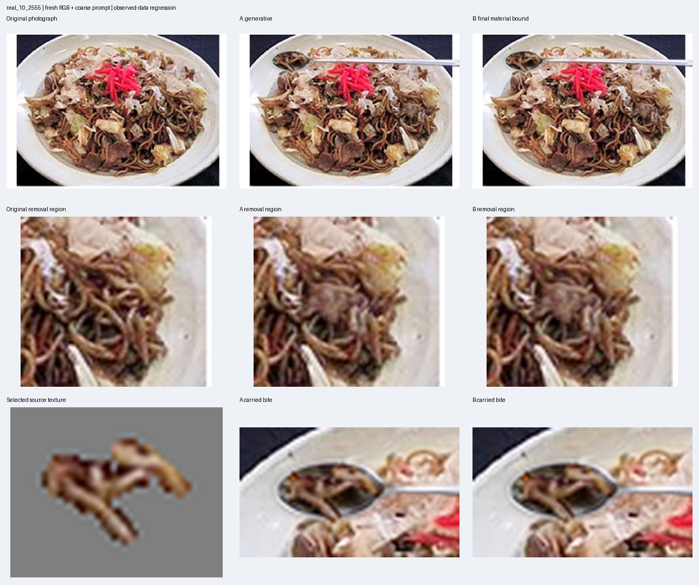

[原图](assets/real_10_2555/source.png) · [生成 A](assets/real_10_2555/A.png) · [最终 B](assets/real_10_2555/final.png)

勺上深色细条颜色对应源选中纹理，但很小且支撑细节不清楚；源区新出现一块灰棕色肉状物，减量失败。

## real_11_7662 · noodles

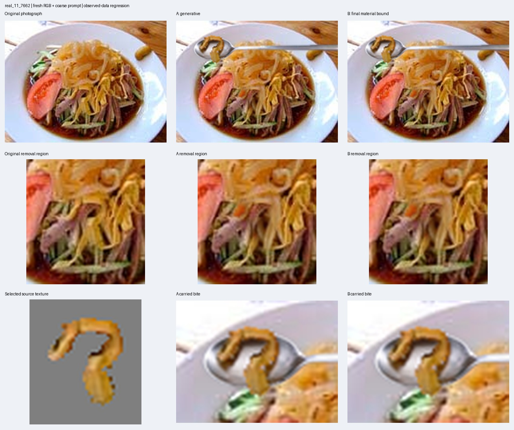

[原图](assets/real_11_7662/source.png) · [生成 A](assets/real_11_7662/A.png) · [最终 B](assets/real_11_7662/final.png)

勺上材料是偏平的弯环和垂片，难以确定合理三维形状；源处出现橙色物，改变了配料而没有可靠取走缺口。

## real_12_4916 · grilled fish

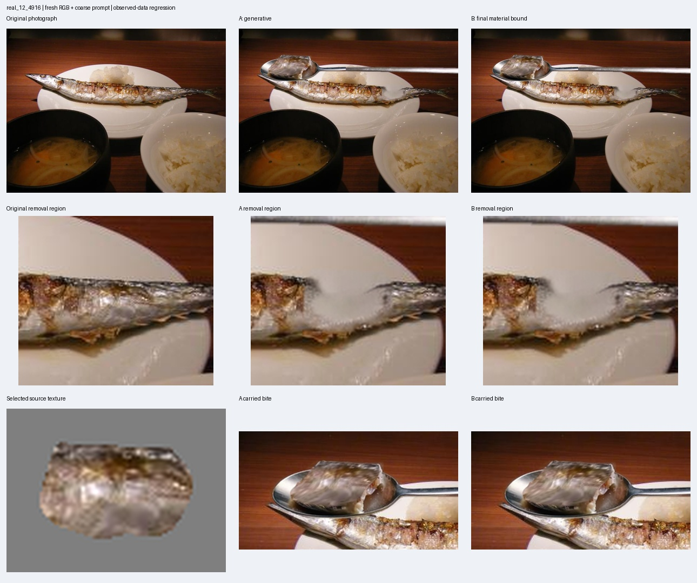

[原图](assets/real_12_4916/source.png) · [生成 A](assets/real_12_4916/A.png) · [最终 B](assets/real_12_4916/final.png)

勺上鱼皮纹理与源相容；原鱼尾部确有缺失，但露出区域是一片很平的浅色，边界与鱼肉厚度不自然，不能确信合理揭露层。

## real_13_7118 · fried egg

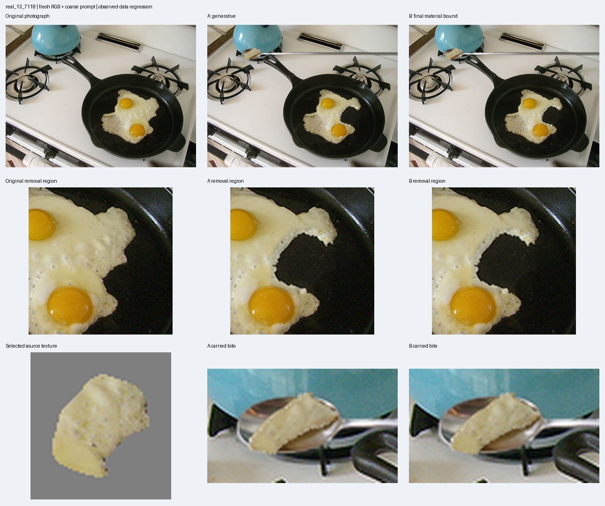

[原图](assets/real_13_7118/source.png) · [生成 A](assets/real_13_7118/A.png) · [最终 B](assets/real_13_7118/final.png)

蛋白出现明确开放缺口、露出黑锅面，勺上食物明显离盘且被托住；勺上蛋白较平、下缘偏直硬，整体自然度仍不确定。

## real_14_1904 · noodles

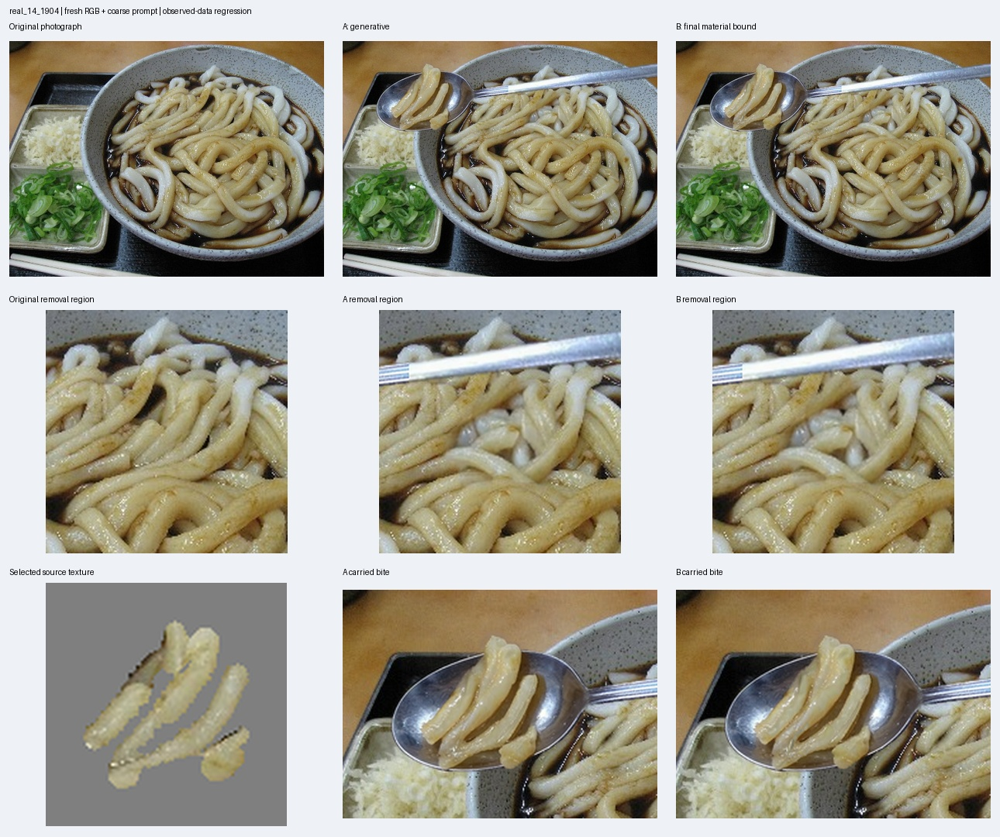

[原图](assets/real_14_1904/source.png) · [生成 A](assets/real_14_1904/A.png) · [最终 B](assets/real_14_1904/final.png)

勺上乌冬条颜色相容且有明显承托。原位置仍被重画的面条填满，底下可能还有面条，单图无法确认合理减量；局部宽扁面与勺柄接缝仍有疑点。

## real_15_11404 · meat

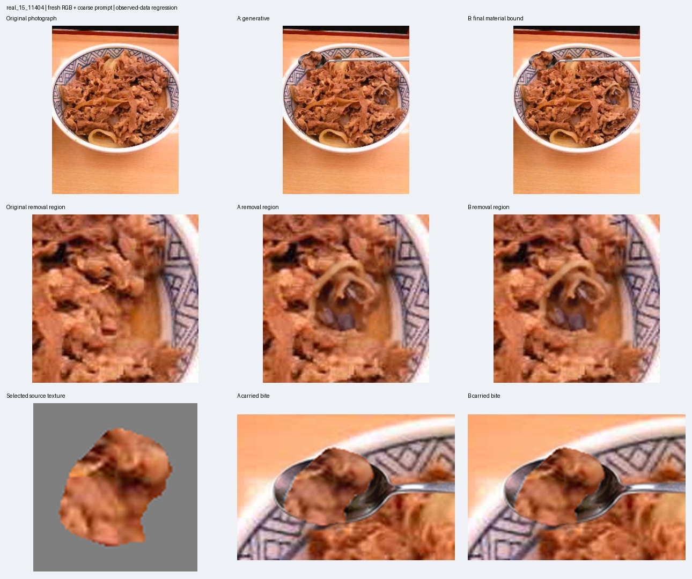

[原图](assets/real_15_11404/source.png) · [生成 A](assets/real_15_11404/A.png) · [最终 B](assets/real_15_11404/final.png)

薄肉片被抬起，原位置出现暗色缺口和弯曲配料；可解释为下层食物，但无法确认缺口与被取走的一口一致，勺头边缘有较硬裁切感。

## real_16_3264 · grilled eggplant

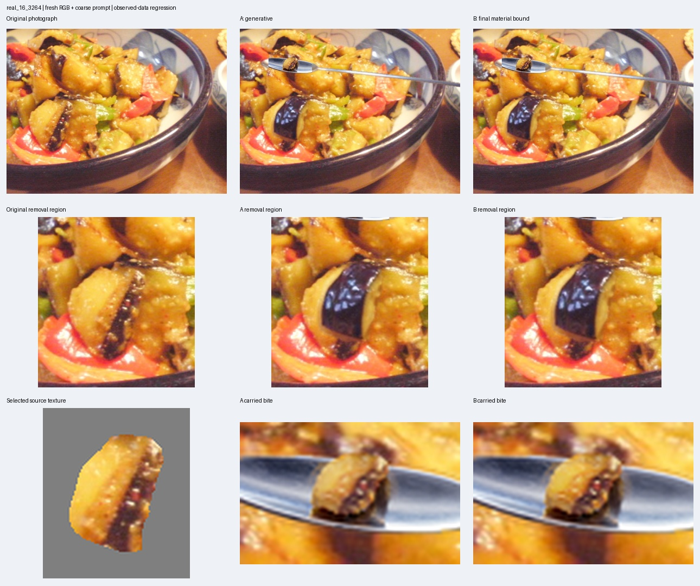

[原图](assets/real_16_3264/source.png) · [生成 A](assets/real_16_3264/A.png) · [最终 B](assets/real_16_3264/final.png)

搬运片的黄色内部与紫皮相容，但原茄子被补成更完整的深紫外皮块，未合理减量；勺头出现矩形银灰色边界，整体有明显拼接感。

## real_17_6275 · food

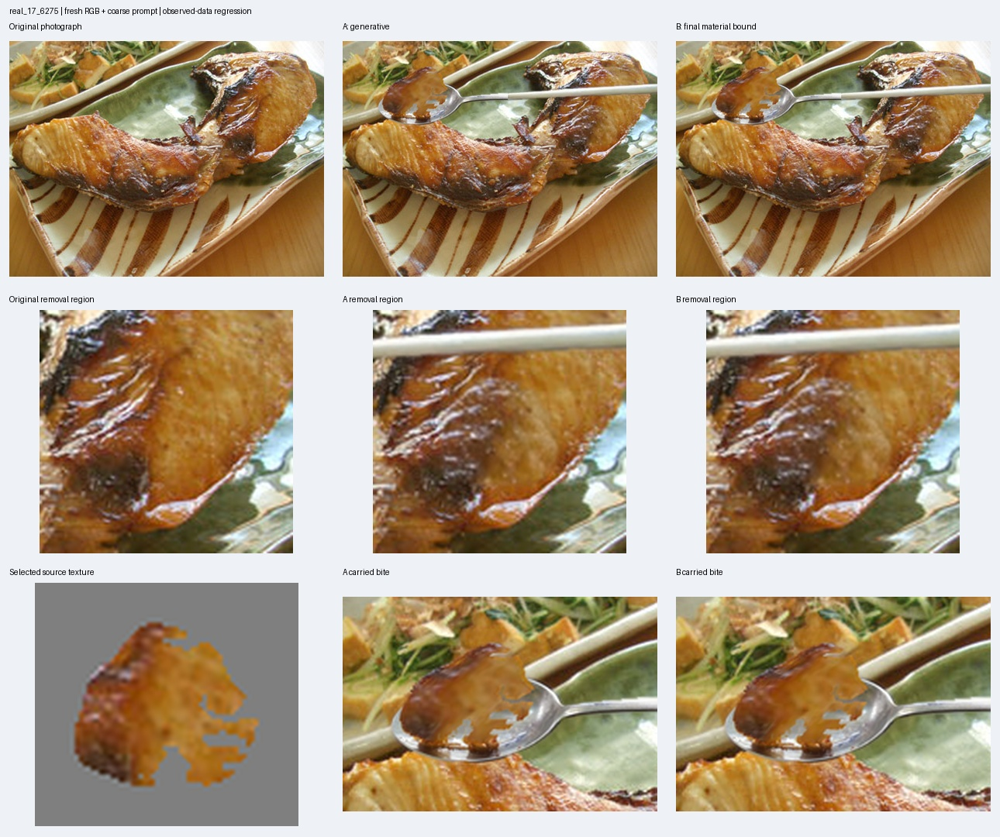

[原图](assets/real_17_6275/source.png) · [生成 A](assets/real_17_6275/A.png) · [最终 B](assets/real_17_6275/final.png)

勺上材料保留褐色但边缘像梳齿状薄片，不能形成可信的鱼肉第一口；源鱼片仍被重新填满。B 没有改善这类几何和缺口问题。

## real_18_4646 · food

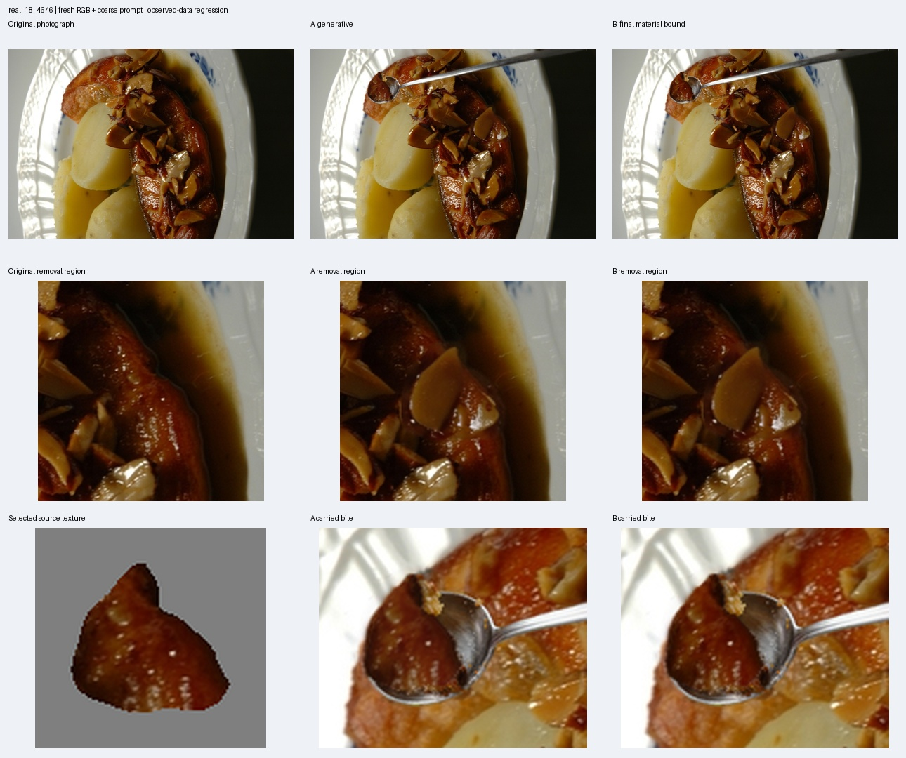

[原图](assets/real_18_4646/source.png) · [生成 A](assets/real_18_4646/A.png) · [最终 B](assets/real_18_4646/final.png)

勺上烤肉片色泽与源相容，柄从上边框离画；原取食区新增蒜片状配料、主体仍完整，源减量失败。

## real_19_2405 · food

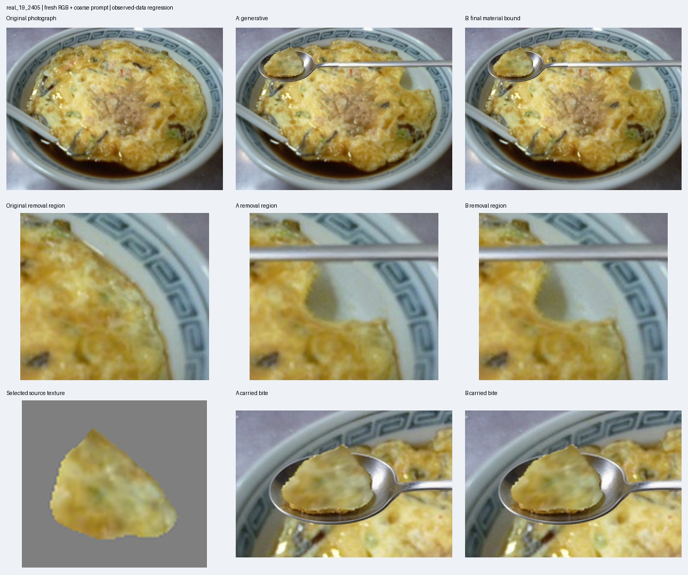

[原图](assets/real_19_2405/source.png) · [生成 A](assets/real_19_2405/A.png) · [最终 B](assets/real_19_2405/final.png)

蛋饼边缘形成开放缺口，勺上小片相容且有承托；缺口内灰色影块的层次不清楚，勺上表面过于平滑，真实感仍不确定。

## real_20_8925 · spaghetti meat sauce

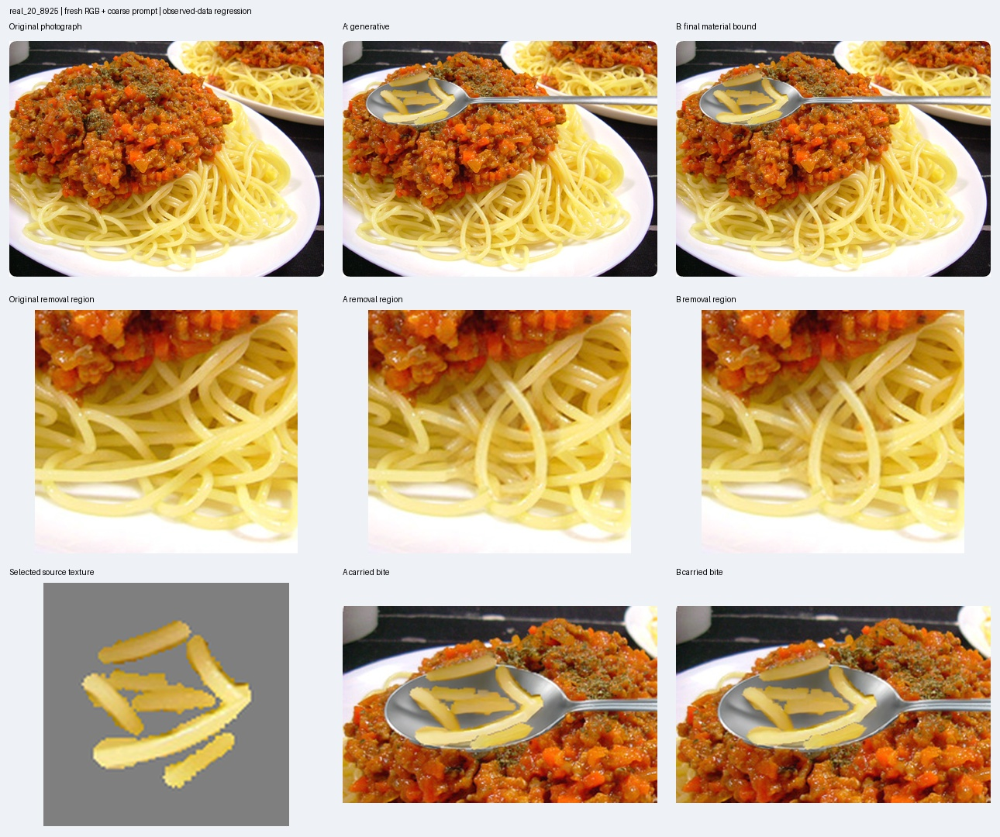

[原图](assets/real_20_8925/source.png) · [生成 A](assets/real_20_8925/A.png) · [最终 B](assets/real_20_8925/final.png)

勺上意面呈宽而扁、近乎纯色的条片，勺子和食物都有明显合成感；源区又画出新的面条环，不能视为自然的第一口编辑。

## real_21_15805 · spaghetti

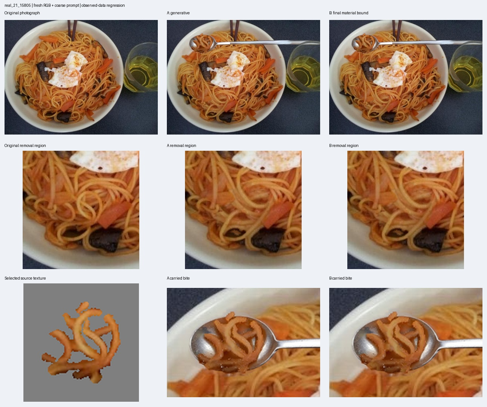

[原图](assets/real_21_15805/source.png) · [生成 A](assets/real_21_15805/A.png) · [最终 B](assets/real_21_15805/final.png)

被抬起的细条变粗、变平，像褐色带状片；源位置仍有新生成的完整面条曲线，未看到可信减量。柄出画，但外观问题保留。

## real_22_4792 · rice

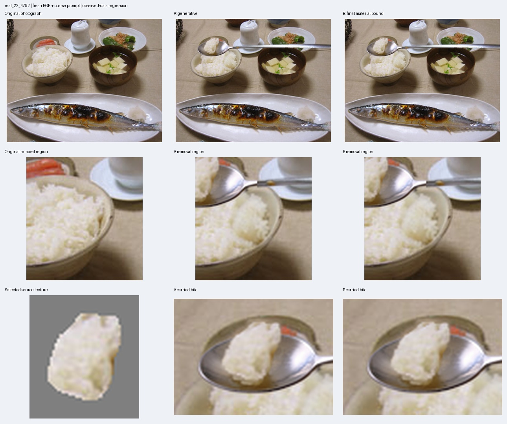

[原图](assets/real_22_4792/source.png) · [生成 A](assets/real_22_4792/A.png) · [最终 B](assets/real_22_4792/final.png)

米饭块被勺子托起、色泽相容；原碗中相应位置却重建成另一块突起饭团，缺口被补回。勺上米饭边界偏规则。

## real_23_5280 · food

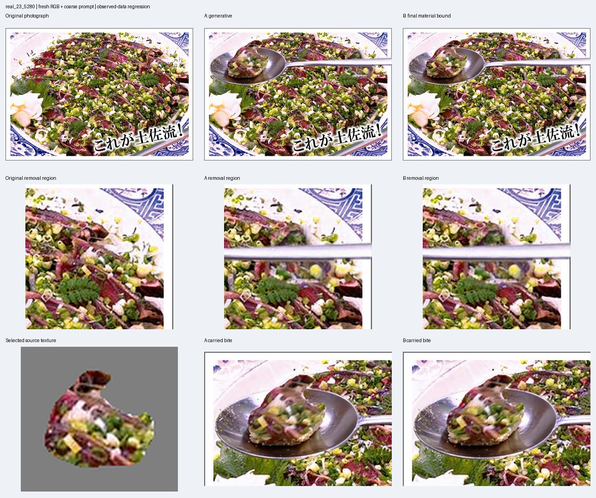

[原图](assets/real_23_5280/source.png) · [生成 A](assets/real_23_5280/A.png) · [最终 B](assets/real_23_5280/final.png)

搬运区域混合鱼肉和葱花颜色，但形状像不规则薄片且细节扭曲；源区形成灰色环状重绘与新配料，无法确认正确取走同一口。
